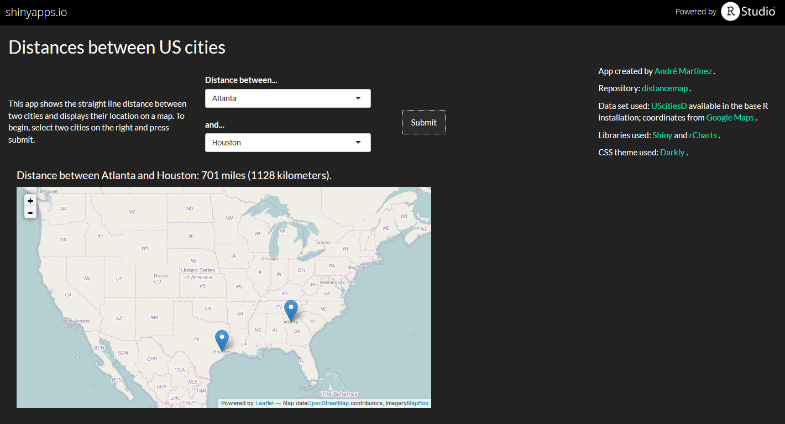

## Introduction

This application returns the straight line distance between two US cities. It then proceeds to add a marker on a map of the United States so the user can see where both cities are located. The user simply has to choose two cities and press "Submit".




--- 
## Layout

The layout is simple. The documentation is at the top left, indicating that the user simply needs to choose two cities from the menu to the right and press the "Submit" button.  
Further to the right are useful links, references and materials used.  

Below this row is a line where the distance between the two cities is shown, in both miles and kilometers.  

Finally, there is a map of the United States where the markers for each city are placed.


---
## Example

In this example, we'll get the distance between Chicago and San Francisco.
Note: since there seems to be an issue with shiny apps in Slidify, the cities can't be chosen in this example.


```
## [1] "Distance between Chicago and San Francisco: 1858 miles (2990 kilometers)."
```

<iframe srcdoc=' &lt;!doctype HTML&gt;
&lt;meta charset = &#039;utf-8&#039;&gt;
&lt;html&gt;
  &lt;head&gt;
    &lt;link rel=&#039;stylesheet&#039; href=&#039;http://cdn.leafletjs.com/leaflet-0.5.1/leaflet.css&#039;&gt;
    
    &lt;script src=&#039;http://cdn.leafletjs.com/leaflet-0.5.1/leaflet.js&#039; type=&#039;text/javascript&#039;&gt;&lt;/script&gt;
    &lt;script src=&#039;https://rawgithub.com/leaflet-extras/leaflet-providers/gh-pages/leaflet-providers.js&#039; type=&#039;text/javascript&#039;&gt;&lt;/script&gt;
    &lt;script src=&#039;http://harrywood.co.uk/maps/examples/leaflet/leaflet-plugins/layer/vector/KML.js&#039; type=&#039;text/javascript&#039;&gt;&lt;/script&gt;
    
    &lt;style&gt;
    .rChart {
      display: block;
      margin-left: auto; 
      margin-right: auto;
      width: 750px;
      height: 400px;
    }  
    &lt;/style&gt;
    
  &lt;/head&gt;
  &lt;body &gt;
    
    &lt;div id = &#039;chartaac37abb3f&#039; class = &#039;rChart leaflet&#039;&gt;&lt;/div&gt;    
    &lt;script&gt;
  var spec = {
 &quot;dom&quot;: &quot;chartaac37abb3f&quot;,
&quot;width&quot;:            750,
&quot;height&quot;:            400,
&quot;urlTemplate&quot;: &quot;http://{s}.tile.osm.org/{z}/{x}/{y}.png&quot;,
&quot;layerOpts&quot;: {
 &quot;attribution&quot;: &quot;Map data&lt;a href=\&quot;http://openstreetmap.org\&quot;&gt;OpenStreetMap&lt;/a&gt;\n         contributors, Imagery&lt;a href=\&quot;http://mapbox.com\&quot;&gt;MapBox&lt;/a&gt;&quot; 
},
&quot;center&quot;: [             37,            -95 ],
&quot;zoom&quot;:              4,
&quot;id&quot;: &quot;chartaac37abb3f&quot; 
}

  var map = L.map(spec.dom, spec.mapOpts)
  
    map.setView(spec.center, spec.zoom);

    if (spec.provider){
      L.tileLayer.provider(spec.provider).addTo(map)    
    } else {
		  L.tileLayer(spec.urlTemplate, spec.layerOpts).addTo(map)
    }
     
    L
  .marker([
   41.8,
 -87.7 
])
  .addTo( map )
  .bindPopup(&quot;Chicago&quot;)
L
  .marker([
 37.779,
-122.42 
])
  .addTo( map )
  .bindPopup(&quot;San Francisco&quot;)
    
    
    
    
    if (spec.circle2){
      for (var c in spec.circle2){
        var circle = L.circle(c.center, c.radius, c.opts)
         .addTo(map);
      }
    }
    
    
    
    
    
   
   
   
&lt;/script&gt;
    
    &lt;script&gt;&lt;/script&gt;    
  &lt;/body&gt;
&lt;/html&gt; ' scrolling='no' frameBorder='0' seamless class='rChart  leaflet  ' id='iframe-chartaac37abb3f'> </iframe>
 <style>iframe.rChart{ width: 100%; height: 400px;}</style>


---
## Future Improvements


These are some of the possible improvements that can be added to an application like this:  
<br />  

* Create a line that connects both cities/markers.  
    * Problem: requires heavy use of JSON.  
    * Possible solution: use other mapping libraries.
    
<br />
  
* Add more cities.  
    * Problem: This app uses two data sets, one with the [distances between cities](http://stat.ethz.ch/R-manual/R-devel/library/datasets/html/eurodist.html) and another with the coordinates for each city.  
    * Possible solution: create one data set with the coordinates for each city and calculate distances as they are needed.  
